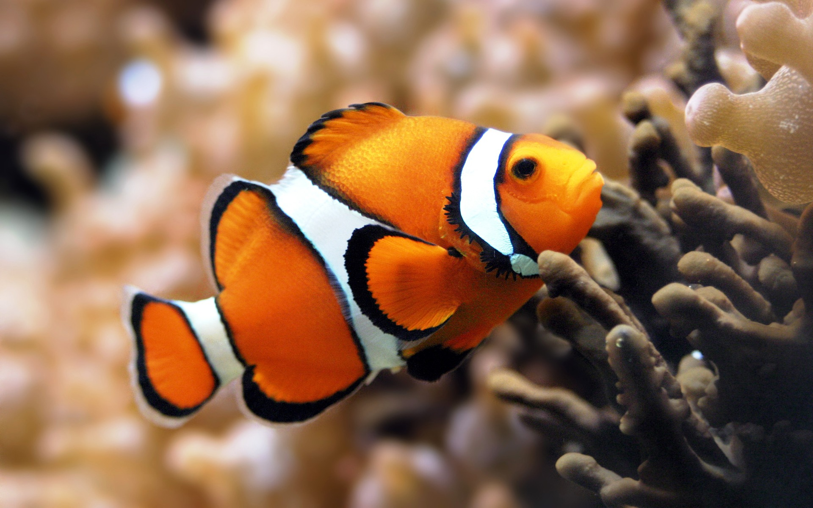

#CSS Selectors and Basic styling

so we are gonna make a web page and add a stylesheet to it...

###Learning Objectives:

by the end of this class students will be able to...

- Match CSS selectors to DOM elements
- Style a page's fonts and background colors with CSS
        - font families
        - weights and decoration
        - colors (words, hex, rgba)
- Demonstrate knowledge of the box model by styling the padding, border, and margin of a basic div

###CSS Selectors

CSS selectors allow you to select and manipulate HTML element(s).

CSS selectors are used to "find" (or select) HTML elements based on their id, classes, types, attributes, values of attributes and much more.

###The element Selector
The element selector selects elements based on the element name.

You can select all `<p>` elements on a page like this: (all `<p>` elements will be center-aligned, with a red text color)

**example**

```
p {
    text-align: center;
    color: red;
}
```

###The id Selector

The id selector uses the id attribute of an HTML tag to find the specific element.

An id should be unique within a page, so you should use the id selector when you want to find a single, unique element.

To find an element with a specific id, write a hash character, followed by the id of the element.

The style rule below will be applied to the HTML element with id="content":

```
#content {
    text-align: center;
    color: red;
}
```
###The class Selector

The class selector finds elements with the specific class.

The class selector uses the HTML class attribute.

To find elements with a specific class, write a period character, followed by the name of the class:

In the example below, all HTML elements with class="center" will be center-aligned and given a color of red:

Example

```
.center {
    text-align: center;
    color: red;
}
```

You can also specify that only specific HTML elements should be affected by a class.

In the example below, all `p` elements with class="center" will be center-aligned:

```
p.center {
    text-align: center;
    color: red;
}
```


let's build a page....

	cd ~/Desktop

	mkdir basicpage
	
create this file structure
	
```
├── another-page.html
├── css
│   └── stylesheet.css
├── image
│   └── fish.jpg
└── index.html
```
let's open our main index.html page and build stuff

inside our new page

tag by tag 

until...

	INSTRUCTOR note: make 'em build it!

**basicpage.html**

```
<!doctype html>
<html>
	<head>
	    <title>basic css and html - part2</title>
	    <!-- <link type="text/css" rel="stylesheet" href="css/stylesheet.css" /> -->
	</head>
	<body>
		
		
		<div id="content">
			Hi, I'm just some text inside the main "content" div.
		    <div class="article">
				<h3 class="article_header">News: Nemo finds slipsum!</h3>
				<p class="article_paragraph">
					
					Well, the way they make shows is, they make one show. That show's called a pilot. Then they show that show to the people who make shows, and on the strength of that one show they decide if they're going to make more shows. Some pilots get picked and become television programs. Some don't, become nothing. She starred in one of the ones that became nothing.  
					<br>
					<a href="another-page.html">Go to another-page.html</a>
				</p>
		    </div>
		</div>

		
	</body>
</html>
```

where going to add a css stylesheet as well...

**stylesheet.css**

```
#content{
	height:200px;
	width:800px;
}

.article{
	padding: 20px;
	margin-top: 20px;
	margin-bottom: 20px;
	height:100%;
	background-color:silver;
	border-radius: 10px;
}

.article_header {
	font-size: large;
	font-family: sans-serif;
	font-weight: bold;
	margin-bottom: 10px;
}

.article_paragraph{
	
}

.article_image{
	width: 100px;
	height: 100px;
	float:left;
	border:1px dotted black;
	margin:0px 15px 0px 0px;
}

.section{
	height:100%;
	width:50%;
	text-align: center;
	background-color:green;
	border-radius: 10px;	
}


.float_left {
	float: left;
}

.float_right {
	float: right;
}

.clear_both{
	clear:both;
}
html{
	display: table;
	margin:auto;
}

body{
	display: table-cell;
	vertical-align: middle;
}

```

now download this image file into the same folder...(left click or control click)



Now we are going to play with the code in both files to get a better understanding of 

- How to connect css to your html document
- play with id and class
- change html elements via css code

let's start by changing this...

	<!-- <link type="text/css" rel="stylesheet" href="stylesheet.css" /> -->

to this...

	<link type="text/css" rel="stylesheet" href="stylesheet.css" />

NOTE: Change various elements in the stylesheet.css file and see how it changes the basicpage.html file. Explore what this means for class and id selectors.


Now let us talk about BOX MODEL

Every element is a rectangular box, and there are several properties that determine the size of that box. 

Each part of the box model corresponds to a CSS property: `width`, `height`, `padding`, `border`, and `margin`.


###Box Model


Explore the fishy on our page via the Chrome inspector magnify lens...compare that to the code in our html and css files.

Let's play here and see what things do.

```
	<div>
		<div id="box" class="border-solid">2px <br> solid</div>

		<div id="box" class="border-double">6px <br> double</div>

		<div id="box" class="border-dashed">8px <br> dashed</div>
	</div>
```


###Display

Exactly how elements are displayed is determined by the display property.

There are quite a few values for the display property, but the most common are block, inline, inline-block, and none.

let's play in our **stylsheet.css**

```
	#box {
		display: inline-block;
	}
	
	p{
		display: block;
	}
```

###Inline vs. block-level
**Content model**

	Generally, inline elements may contain only data and other inline elements.
	They line up side by side.

**Formatting**

	By default, inline elements do not begin with new line.
	
###Block-level vs. inline
**Formatting**

	By default, block-level elements begin on new lines.
	They can be stacked

**Content model**

	Generally, block-level elements may contain inline elements and other block-level elements. Inherent in this structural distinction is the idea that block elements create "larger" structures than inline elements.

###resources:
[html glossary](http://www.codecademy.com/glossary/html)

[css selectors](http://www.w3schools.com/css/)

[HTML Block-level elements](https://developer.mozilla.org/en-US/docs/Web/HTML/Block-level_elements)

[HTML Inline elements](https://developer.mozilla.org/en-US/docs/Web/HTML/Inline_elemente)

[opacity in css - rgba](http://www.css3.info/introduction-opacity-rgba/)

[css gradients](http://www.css3files.com/gradient/?)

**ID Selector controversy**

[Against](http://screwlewse.com/2010/07/dont-use-id-selectors-in-css/)

[For](https://2002-2012.mattwilcox.net/archive/entry/id/1054/) note: read the responses on this post page toward the bottom.

Note: I would invite you the student to read carefully both the pro and against positions. As a learner you must first learn the tools ...as a you journey to becoming a master you learn WHEN to break them. Choose your own speed on this path :)

----
Compiled and edited by Alfonso Rush