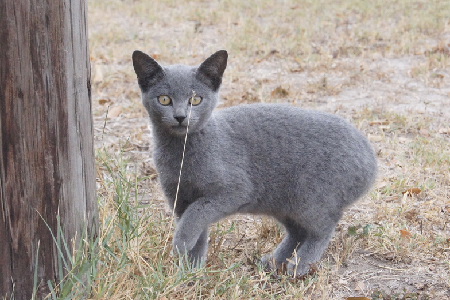

#Sample Personas

Here is a sample set of personas for typical users of Jen' and Meredith's fake app, *Catbook* (a social network for cats).

There are many ways to draft and present personas; feel free to research alternative formats. 

##Wilbur

- Orange housecat, lives indoors. 
- 3 years old. 
- Owner, Minerva, is a busy teacher who often leaves him at home. 
- Unemployed and has a great deal of leisure time. 
- Enjoys socializing with humans and other cats in-person and online.
- Likes: catnip, reality tv, Minerva. Dislikes: spiders, canned tuna, vacuum cleaners. 
- A technology-savvy cat who loves using Minerva's laptop and iPad.

##Minerva

- Human. 
- 28 years old.
- Lives in Santa Monica. 
- Science teacher. 
- Self-professed "cat lady" with two housecats (Wilbur and Lionel).
- Single, with moderate amount of disposable income.
- Likes: cats, research, tweeting. Dislikes: her neighbors, bureaucracy, gluten. 
- Early adopter of most new apps/social networks.
- Still talks to most of her friends from high school.

##Lionel

- Orange and brown housecat, lives indoors. 
- 0 years old (kitten). 
- Not very good at socializing yet.
- Unemployed (child).
- Likes: snacks, naps, toys with feathers on the end. Dislikes: loud noises, the litter box, trips to the vet. 
- Often mimics behaviors of older cats like Wilbur.
- Not experienced with technology, but curious about iPad.

##Gregor

- Grey housecat, lives outdoors. 
- 8 years old. 
- Wary of strange cats and humans. 
- Employed as member of neighborhood watch. 
- Likes: naps, flowers, familiar cats. Dislikes: rain, cars, strangers. 
- Not very great with technology.
- Socially exclusive; very concerned with privacy.